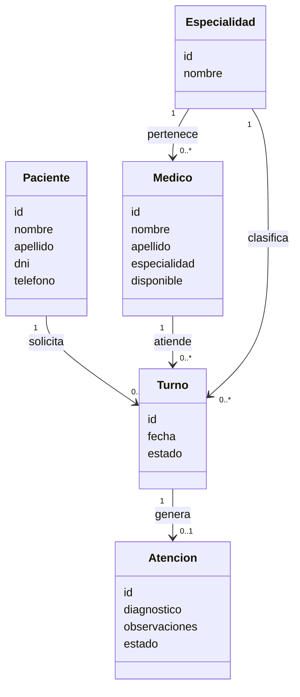

# Propuesta TP-DSW-303

## Grupo
### Integrantes
* Garcia, Miqueas Cristián - 55033
* Paulucci, Gino - 53670
* Zapata, Mayra Belén - 42969

### Repositorios
* [frontend app](https://github.com/MayraZapata/TP-DSW-Garcia-Paulucci-Zapata/tree/main/frontend)
* [backend app](https://github.com/MayraZapata/TP-DSW-Garcia-Paulucci-Zapata/tree/main/backend)

## Tema
### Descripción
El sistema propuesto es una aplicación web destinada a la gestión de turnos médicos para un centro de salud. Permite administrar pacientes, médicos y especialidades, facilitando la asignación de turnos según disponibilidad y evitando superposición de horarios. La aplicación contempla distintos tipos de usuarios: los pacientes pueden solicitar turnos, mientras que los profesionales acceden a la gestión y visualización de sus turnos y pacientes asignados. Además, permite registrar las atenciones realizadas, brindando un seguimiento básico del historial de cada paciente.

### Modelo de Dominio

## Alcance Funcional 

### Alcance Mínimo
Regularidad:
|Req|Detalle|
|:-|:-|
|CRUD simple|1. CRUD  Paciente 2. CRUD Médico 3. CRUD Especialidad|
|CRUD dependiente|1. CRUD Turno {depende de} CRUD Paciente, Médico y Especialidad 2. CRUD Atención {depende de} CRUD Turno|
| Listado + detalle | 1. Listado de turnos filtrado por fecha y/o médico → detalle muestra información completa del turno, paciente y médico 2. Listado de pacientes → detalle muestra datos del paciente y sus turnos |
| CUU/Epic  | 1. Reservar turno médico (selección de paciente, especialidad, médico y fecha) 2. Registrar atención médica (diagnóstico, observaciones y estado del turno) |

Adicionales para Aprobación
|Req|Detalle|
|:-|:-|
| CRUD     | 1. CRUD Paciente 2. CRUD Médico 3. CRUD Especialidad 4. CRUD Turno 5. CRUD Atención |
| CUU/Epic | 1. Reservar turno médico 2. Registrar atención médica 3. Consulta de historial clínico del paciente (visualización de atenciones previas) |

### Alcance Adicional Voluntario
|Req|Detalle|
|:-|:-|
| Listados | 1. Listado de turnos filtrado por estado (pendiente, confirmado, cancelado) 2. Listado de médicos filtrado por especialidad |
| CUU/Epic | 1. Cancelación de turno 2. Reprogramación de turno |
| Otros    | 1. Validación de disponibilidad de médicos para evitar superposición de turnos 2. Control de conflictos de horarios en tiempo real |

