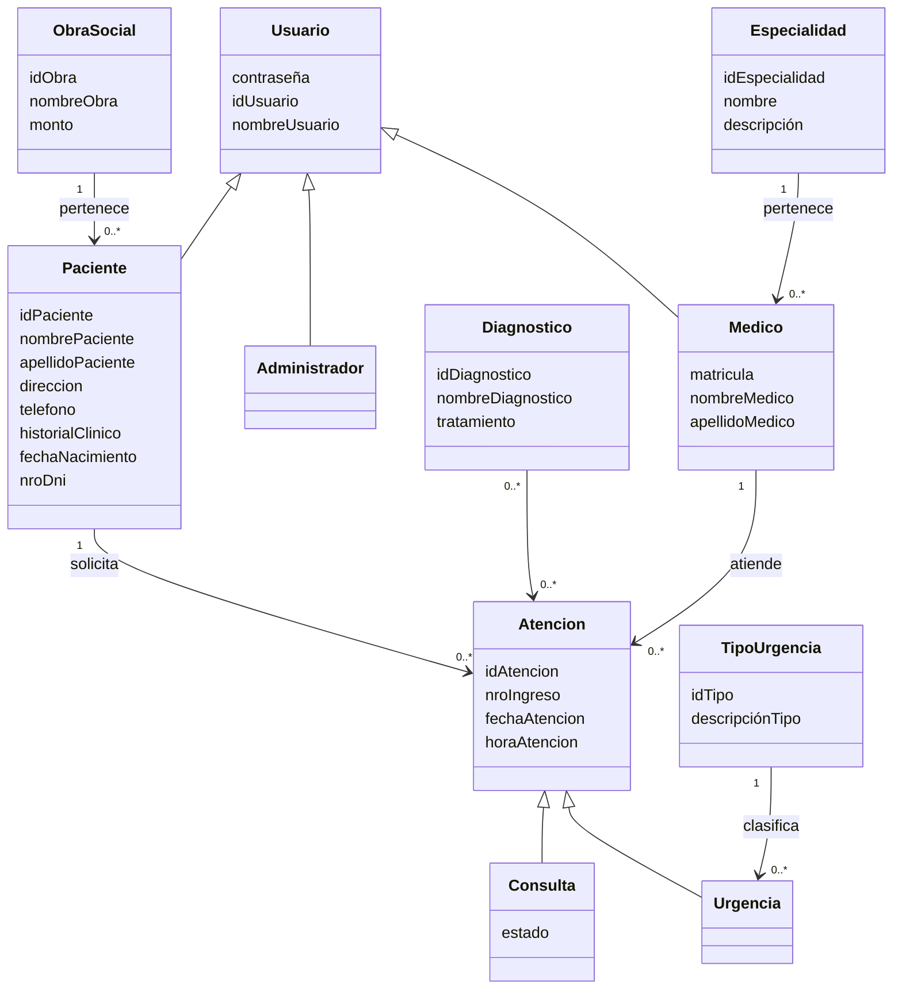

# Propuesta TP-DSW-303

## Grupo
### Integrantes
* Garcia, Miqueas Cristián - 55033
* Paulucci, Gino - 53670
* Zapata, Mayra Belén - 42969

### Repositorios
* [frontend app](https://github.com/MayraZapata/TP-DSW-Garcia-Paulucci-Zapata/tree/main/frontend)
* [backend app](https://github.com/MayraZapata/TP-DSW-Garcia-Paulucci-Zapata/tree/main/backend)

## Tema
### Descripción
El sistema propuesto es una aplicación web destinada a la gestión de turnos médicos para un centro de salud. Permite administrar las atenciones entre pacientes y médicos, facilitando la asignación de turnos según disponibilidad y evitando superposición de horarios. La aplicación contempla distintos tipos de usuarios: los administradores registran a los medicos, visualizan el historial clinico del paciente y verifican los turnos vencidos (no asistidos), los pacientes pueden solicitar turnos y los profesionales acceden a la gestión y visualización de sus turnos y pacientes asignados. Además, permite clasificar las atenciones en consultas (las realizadas por turno) o en una urgencia que deba ser registrada por el administrador.

### Modelo de Dominio

## Alcance Funcional 

### Alcance Mínimo
Regularidad:
|Req|Detalle|
|:-|:-|
|CRUD simple|1. CRUD  Paciente 2. CRUD Diagnostico 3. CRUD Especialidad|
|CRUD dependiente|1. CRUD Urgencia {depende de} CRUD TipoUrgencia 2. CRUD Medico {depende de} CRUD Especialidad|
| Listado + detalle | 1. Listado de turnos filtrado por fecha y/o médico → detalle muestra información completa del turno, paciente y médico 2. Listado de pacientes → detalle muestra datos del paciente y sus turnos |
| CUU/Epic  | 1. Reservar turno médico de consulta  2. Cancelar turno |

Adicionales para Aprobación
|Req|Detalle|
|:-|:-|
| CRUD     | 1. CRUD TipoUrgencia 2. CRUD ObraSocial 3. CRUD Usuario |
| CUU/Epic | 1. Verificar los estados de turnos por fechas 2. Consultar turnos del medico 3. Consulta de historial clínico del paciente (visualización de atenciones previas) 4. Registrar urgencia |

